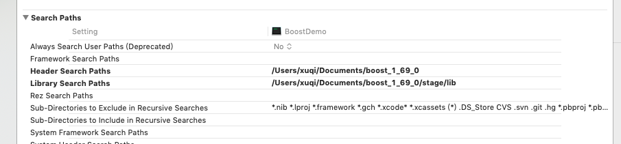

## BoostDemo
#### 1. 下载编译使用

 [下载地址](https://dl.bintray.com/boostorg/release/1.69.0/source/)
 
```
./bootstrap.sh;./b2
```
第一条命令bootstrap.sh是编译前的配置工作,第二条命令b2开始

Makefile:

```
CFLAGS= -std=c++11 					#Linux应使用gnu++0x
INCLUDE=I/Users/chrono/boost/ 	#Boost库安装在用户主目录
STDLIB= -stdlib=libc++  			#Linux无需此FLAG
```

XCode配置：




#### 2. Timer库

+ timer
+ progress_display

###### 处理日期

```
#define BOOST_DATE_TIME_SOURCE
#include <boost/date_time/gregorian/gregorian.hpp>
using namespace boost::gregorian;

```
+ date
+ date_period

###### 处理时间

```
#include <boost/date_time/posix_time/posix_time.hpp>
using namespace boost::posix_time;
```
+ hours
+ minutes
+ seconds
+ milliseconds
+ time_duration
+ ptime
+ time_period

#### 3. 内存管理
##### smart_ptr库
+ Raii机制 （资源获取就是初始化）
+ 智能指针

```
#include <boost/smart_ptr.hpp>
using namespace boost;
```
+ 自动指针

```
auto_ptr<ClassA> a(new ClassA);
```

##### XCode 编译器配置为C++11


##### C++98

+ auto_ptr 

##### boost.smart_ptr (6种智能指针)

+ scoped_ptr （不能赋值，比较,可以使用unique_ptr替代，不可以使用容器）
+ scoped_array (不推荐使用)
+ share_ptr (引用计数，可以赋值，可以放入容器) `make_share 不使用new 创建对象` 
+ share_array
+ weak_ptr (打破循环引用)
+ intrusive_ptr (不推荐使用)

##### C++11

+ unique_ptr (可以比较，不允许赋值，可以放入容器)
+ share_ptr
+ weak_ptr

#### pool

+ pool
+ object_pool
+ singleton_pool
+ pool_alloc

### 实用工具

+ noncopyable

+ typeof
	
	**C++ 11**
	- auto
	- decltype
	
	**Boost**
	
	```
	#include<boost/typeof/typeof.hpp>
	
	```
	
	- BOOST_TYPEOF
	- BOOST_AUTO


